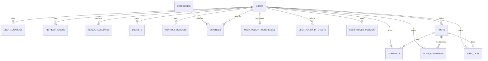

# Survival Diary Backend

## 1. 프로젝트 소개

**Survival Diary / 생존일기**는 청년의 경제적 자립과 생활비 관리를 돕기 위해 지출·예산 관리, 청년 정책 추천, 절약 장소 탐색, 맞춤 뉴스와 커뮤니티 기능을 제공하는 서비스입니다.

이 저장소는 Flutter 앱과 웹 클라이언트가 공통으로 사용하는 Spring Boot REST API 서버입니다. 사용자 인증과 권한 검사, 비즈니스 규칙 적용, MySQL 데이터 저장, 공공데이터·지도·정책·뉴스 API 연동을 담당합니다.

## 2. 백엔드 역할

### DB를 사용하는 요청

```text
Flutter / Web Client
        ↓ HTTP + JSON
Spring Security / JWT Filter
        ↓ 인증 사용자 ID와 권한 등록
Controller
        ↓ DTO 검증 및 Service 호출
Service
        ↓ 비즈니스 로직과 트랜잭션
Repository (Spring Data JPA / JPQL / Native SQL)
        ↓
MySQL
```

JWT 인증이 필요한 요청에서는 `JwtAuthenticationFilter`가 `Authorization: Bearer <access-token>`을 검증하고, JWT의 사용자 ID를 `SecurityContext`의 principal로 등록합니다. Controller는 이를 `@AuthenticationPrincipal Long userId`로 전달받습니다.

### 외부 API를 사용하는 요청

```text
Flutter / Web Client
        ↓
Controller → Service → External API Client (Spring RestClient)
                            ↓
              정책 / 지도 / 공공데이터 / 뉴스 / OAuth API
                            ↓
              응답 검증·정규화·필터링·캐싱
        ← DTO + ApiResponse ←
```

정책과 지도 데이터는 주로 외부 제공처에서 실시간 또는 메모리 캐시 기반으로 조회합니다. 뉴스는 외부 검색 결과를 정제해 `news_articles`에 동기화한 뒤 사용자 관심사에 따라 정렬합니다.

## 3. 주요 기능

| 영역 | 구현된 주요 기능 | 관련 계층 |
|---|---|---|
| 사용자·인증 | 이메일 회원가입/로그인, Kakao·Naver 앱 및 웹 로그인, JWT 재발급·로그아웃, 내 정보·기본 거주지·프로필 이미지 관리 | Controller / Service / Repository / Entity / Social Client |
| 지출 | 직접 입력, 결제 알림 감지 지출 저장, 감지 키 중복 방지, 내역 조회·삭제 | Controller / Service / Repository / Entity |
| 예산 | 일일·월간 예산 저장 및 조회, 이전에 설정한 최신 예산의 이월 조회 | Controller / Service / Repository / Entity |
| 홈 | 오늘·주간·월간 예산과 지출 합계, 최다 지출 카테고리 요약 | Controller / Service / 여러 Repository |
| 정책 | 온통청년 실시간 검색·상세, 사용자 조건 저장, 조건 기반 추천·판정, 관심 없음 정책 관리 | Controller / Service / External Client / Repository / Entity |
| 절약 지도 | 착한가격업소, 공공시설, 공영주차장, 전월세 실거래, 장소 검색, 지역 판별, 도보·자동차 경로 | Controller / Service / External Client / DTO |
| 뉴스 | Naver 뉴스 수집·정제·DB 동기화, 회원가입 관심사 기반 추천 | Controller / Service / External Client / Repository / Entity |
| 커뮤니티 | 게시글 CRUD, 카테고리·인기글 조회, 좋아요·북마크, 댓글 작성·조회·삭제 | Controller / Service / Repository / Entity |
| 관리자 | 회원 검색, 회원별 지출 조회, 전체 게시글 조회, 관리자 답변, 게시글 삭제 | Controller / Service / 타 도메인 Service·Repository |

현재 코드에서 확인되는 부분 구현 사항은 다음과 같습니다.

- 홈 응답의 `savedToday`는 현재 항상 `0`을 반환합니다.
- 커뮤니티 게시글은 이미지 URL 목록을 저장하지만, 커뮤니티 이미지 자체를 업로드하는 API는 없습니다. 프로필 이미지만 로컬 파일 저장을 지원합니다.
- `categories`, `notifications`, `policies`, `policy_targets`, `policy_interests`, `places`, `place_prices`, `post_images` 테이블은 Flyway 스키마에 존재하지만 일부 또는 전부에 대응하는 현재 JPA 도메인/API가 없습니다.
- 정책 검색은 Flyway의 `policies` 테이블이 아니라 온통청년 API를 사용합니다. DB에는 정책 선호 조건과 관심 없음 정책만 저장합니다.

## 4. 기술 스택

### Backend

- Java 17
- Spring Boot 4.1.0
- Spring Web MVC
- Jakarta Validation
- Lombok
- Jackson 3(Spring Boot가 제공하는 `tools.jackson`과 일부 Jackson annotation 사용)

### Database

- MySQL 8.x
- Spring Data JPA / Hibernate
- JPQL 및 `EntityManager` 기반 Native SQL
- Flyway + `flyway-mysql`

> QueryDSL 의존성과 생성 코드는 현재 프로젝트에 없습니다.

### Security

- Spring Security
- JJWT 0.12.6
- BCrypt
- Kakao / Naver OAuth API 직접 연동

### API·Build·Test

- Spring `RestClient`
- springdoc-openapi 3.0.3 / Swagger UI
- Gradle Wrapper 9.5.1
- JUnit 5, Spring MVC Test, Spring Security Test, Mock REST server

## 5. 시스템 아키텍처와 공통 처리

### 계층별 역할

| 계층 | 이 프로젝트에서의 역할 |
|---|---|
| Controller | 실제 API 경로를 정의하고 `@Valid`로 요청 DTO를 검증합니다. 인증 사용자 ID를 Service에 전달하며 결과를 `ApiResponse<T>`로 감쌉니다. |
| Service | 소유권·날짜·범위 같은 비즈니스 규칙을 검사하고 `@Transactional` 경계를 설정합니다. 홈·추천처럼 여러 Repository나 외부 Client의 결과도 조합합니다. |
| Repository | `JpaRepository` 파생 쿼리, JPQL 집계·검색, 커뮤니티 좋아요용 Native SQL로 MySQL에 접근합니다. |
| Entity | 현재 13개 JPA Entity가 테이블과 매핑됩니다. 일부 사용자 관계는 객체 연관관계 대신 `userId` 필드로 보관하고 FK 무결성은 Flyway 스키마가 보장합니다. |
| DTO | API 요청·응답 및 외부 제공처 응답을 분리합니다. 요청 record에는 주로 Jakarta Validation 제약을 선언합니다. |
| External Client | `RestClient`로 제공처 인증 헤더·쿼리·타임아웃을 구성하고, 제공처 장애와 잘못된 응답을 공통 `ErrorCode`로 변환합니다. |

### 공통 응답

성공 응답:

```json
{
  "success": true,
  "data": {}
}
```

실패 응답:

```json
{
  "success": false,
  "error": {
    "code": "C001",
    "message": "입력값이 올바르지 않습니다."
  }
}
```

페이지 목록은 `PageResponse<T>`의 `content`, `page`, `size`, `totalElements`, `totalPages`, `hasNext` 필드를 사용합니다.

### 예외 처리

```text
Controller → Service → BusinessException(ErrorCode)
                         ↓
              GlobalExceptionHandler
                         ↓
        HTTP Status + ApiResponse.error(...)
```

`GlobalExceptionHandler`는 비즈니스 예외, 요청 DTO 검증 실패, 최대 업로드 크기 초과, 예상하지 못한 예외를 공통 응답으로 변환합니다. Security Filter 단계의 401/403은 각각 `JwtAuthenticationEntryPoint`와 `JwtAccessDeniedHandler`가 같은 응답 형식으로 처리합니다.

## 6. 프로젝트 구조

```text
SurvivalDiary_Backend/
├─ build.gradle
├─ settings.gradle
├─ gradlew / gradlew.bat
├─ docs/
│  ├─ auth/                    # 인증 계약 참고 문서
│  ├─ policy/                  # 정책 제공처 계약 참고 문서
│  ├─ schema.sql
│  └─ schema-spec.md
└─ src/
   ├─ main/
   │  ├─ java/com/survivaldiary/
   │  │  ├─ SurvivalDiaryApplication.java
   │  │  ├─ domain/
   │  │  │  ├─ admin/
   │  │  │  ├─ budget/
   │  │  │  ├─ community/
   │  │  │  ├─ expense/
   │  │  │  ├─ home/
   │  │  │  ├─ map/
   │  │  │  ├─ news/
   │  │  │  ├─ policy/
   │  │  │  └─ user/
   │  │  └─ global/
   │  │     ├─ common/         # ApiResponse, PageResponse
   │  │     ├─ config/         # Security, Swagger, 정적 파일, 부트스트랩
   │  │     ├─ exception/      # 공통 예외와 ErrorCode
   │  │     └─ security/       # JWT 발급·필터·401/403 처리
   │  └─ resources/
   │     ├─ application.yml
   │     └─ db/migration/      # Flyway 스키마 정본
   └─ test/                    # 서비스·컨트롤러·외부 Client 및 계약 테스트
```

## 7. 도메인별 역할

### User / Auth

이메일 계정과 소셜 계정을 생성하고 서비스 JWT를 발급합니다. 내 정보 수정, 지도 기본 거주지, 프로필 이미지도 이 영역에서 관리합니다.

주요 클래스:

- `AuthController` → `AuthService` → `UserRepository`, `SocialAccountRepository`, `RefreshTokenRepository`
- `UserController` → `UserService` → `UserRepository`, `UserLocationRepository`, `ProfileImageStorage`
- `KakaoSocialProviderClient`, `NaverSocialProviderClient`: 제공처 액세스 토큰 검증
- `SocialOAuthTokenClient`: 웹 authorization code를 제공처 액세스 토큰으로 교환

프로필 이미지는 `PROFILE_IMAGE_DIRECTORY`가 가리키는 로컬 디렉터리에 UUID 파일명으로 저장되고 `/uploads/profile/**`로 제공됩니다. JPG, PNG, WEBP, GIF 및 최대 5MB를 허용합니다.

### Expense

사용자의 직접 입력 및 결제 알림 감지 지출을 저장합니다. 요청의 `userId`와 JWT 사용자 ID가 같은지 검사하고, 직접 입력은 `MANUAL`만 허용합니다. 자동 감지는 `(user_id, detection_key)`의 유일 제약과 선조회로 중복 등록을 방지합니다.

```text
ExpenseController → ExpenseService → ExpenseRepository → Expense → expenses
                                      └→ UserRepository(사용자 확인)
```

현재 지출 수정 API와 별도 통계 API는 없으며, 합계와 상위 카테고리 집계는 홈 요약에서 사용합니다.

### Budget

일일 예산과 월간 예산을 각각 `budgets`, `monthly_budgets`에 저장합니다. 해당 날짜·월에 저장된 값이 없으면 그 이전의 가장 최근 설정을 조회하므로 예산이 이후 기간에 이어집니다.

```text
BudgetController → BudgetService
                 → BudgetRepository / MonthlyBudgetRepository
                 → Budget / MonthlyBudget → MySQL
```

### Home

별도 Entity나 Repository를 두지 않고 User, Budget, MonthlyBudget, Expense 저장소를 조합합니다. Asia/Seoul 기준으로 오늘·이번 주·이번 달 지출, 잔여 일일 예산, 월간 예산, 최다 지출 카테고리를 계산합니다.

```text
HomeSummaryController → HomeSummaryService
                      ├→ UserRepository
                      ├→ BudgetRepository / MonthlyBudgetRepository
                      └→ ExpenseRepository
```

### Policy

온통청년 정책을 실시간 검색하고 외부 응답을 내부 `PolicySummary`/`PolicyDetail`로 변환합니다. 나이, 지역, 근로 상태, 교육 단계·학적 상태, 소득 조건과 관심사를 기준으로 제외·추천·확인 필요 상태를 판정합니다.

사용자 조건은 `user_policy_preferences`와 `user_policy_interests`, 관심 없음 정책은 `user_hidden_policies`에 저장합니다. 추천 시 저장 조건을 검색 요청으로 변환하고 관심 없음 정책 ID를 제외합니다. 기본 탐색 추천은 제공처 최대 3페이지를 확인하고 카테고리 편중을 줄여 정렬합니다.

```text
PolicyController → PolicyService → YouthPolicyClient → 온통청년 API
                         ↓
              Parser → Matcher → Evaluator → Mapper

PolicyPreferenceController → PolicyPreferenceService → PolicyPreferenceRepository
HiddenPolicyController     → HiddenPolicyService     → HiddenPolicyRepository
```

목록 검색 응답은 메모리에서 기본 10분 캐시하고, 일시 장애 시 최대 1시간 이내의 최근 성공 응답을 사용할 수 있습니다. 상세 조회는 캐시하지 않습니다.

### Map

지도 도메인은 현재 자체 장소 Entity/Repository를 사용하지 않고 외부 API 결과를 DTO로 변환합니다. 단, 사용자가 선택한 기본 거주지는 User 도메인의 `user_locations`에 저장합니다.

- 착한가격업소: 지역·지도 영역 필터, 이름·가격 정렬, Naver 지오코딩으로 좌표 보완
- 공공시설: 지도 영역·카테고리·무료 여부 필터와 거리·이름·무료 우선 정렬
- 공영주차장: 지도 영역·무료 여부 필터와 거리·이름·요금 정렬
- 전월세 실거래: 단독·다가구와 오피스텔 데이터를 여러 월에 걸쳐 조회하고 지오코딩
- 장소 검색: Naver 지역 검색 → TMAP POI → Naver 주소 지오코딩 순서로 fallback
- 지역 판별: Naver 역지오코딩 → TMAP 역지오코딩 순서로 fallback
- 경로: TMAP 도보 또는 자동차 경로를 좌표 목록과 거리·시간·요금으로 변환

공공시설과 공영주차장은 기본 24시간, 착한가격업소 지도 영역 스냅샷은 6시간 메모리 캐시를 사용합니다. 외부 장애가 발생해도 이전 스냅샷이 있으면 이를 반환합니다.

### News

추천 API 호출 시 캐시 만료 여부를 확인해 Naver 뉴스 검색 결과를 수집합니다. 청년 관련 키워드와 절약·생활비 관련 키워드를 함께 포함하고 정치 키워드를 포함하지 않는 기사만 유지합니다.

```text
NewsController → NaverNewsSyncService → NaverNewsClient
                       ↓ 정제·중복 제거
                NewsArticleWriter → NewsArticleRepository → news_articles
                       ↓
                PersonalizedNewsService → 관심사 점수 + 최신성 정렬
```

동기화된 Naver 기사는 URL 기반 식별자로 upsert되며 14일이 지난 기사는 정리됩니다. 정상 동기화 간격은 기본 1시간이고 실패 후 재시도 간격은 5분입니다.

### Community

사용자 게시글 목록·인기글·상세·작성·수정·삭제와 좋아요, 북마크, 댓글을 처리합니다. 일반 목록은 USER 작성 게시글만 반환하며, 인기 순서는 좋아요×3 + 댓글×2 + 조회수로 계산합니다.

```text
CommunityController → CommunityService
                    ├→ PostRepository → Post
                    ├→ CommentRepository → Comment
                    ├→ PostBookmarkRepository → PostBookmark
                    └→ PostInteractionRepository → post_likes(Native SQL)
```

글 수정·삭제와 댓글 삭제는 작성자 또는 ADMIN만 가능합니다. ADMIN이 작성하는 글은 댓글 비활성화·숨김 상태를 저장할 수 있습니다.

### Admin

`ROLE_ADMIN` 전용 영역입니다. 이메일·닉네임 기반 회원 검색, 특정 회원 지출 조회, 관리자 화면용 전체 게시글 조회, 게시글 답변과 삭제를 제공합니다. 전용 Repository 대신 User·Expense Repository 및 CommunityService를 조합합니다.

애플리케이션 시작 시 `BootstrapDataInitializer`가 관리자, 테스트 사용자 프로필과 FAQ 데이터를 보장합니다. 운영 환경에서는 부트스트랩 계정 설정을 반드시 별도 값으로 덮어쓰고 테스트 데이터 초기화 정책을 검토해야 합니다.

## 8. 주요 API

별도 표기가 없는 API는 Access Token 인증이 필요합니다. 모든 응답 본문은 `ApiResponse<T>` 형식입니다.

### 인증

| Method | Endpoint | 인증 | 설명 |
|---|---|---|---|
| POST | `/api/auth/signup` | 공개 | 이메일 회원가입 |
| POST | `/api/auth/login` | 공개 | 앱 이메일 로그인, Access/Refresh Token 반환 |
| POST | `/api/auth/web/login` | 공개 | 웹 이메일 로그인, Access Token 응답 + Refresh HttpOnly Cookie |
| POST | `/api/auth/social/kakao` | 공개 | Kakao 액세스 토큰 기반 앱 로그인 |
| POST | `/api/auth/social/naver` | 공개 | Naver 액세스 토큰 기반 앱 로그인 |
| POST | `/api/auth/web/social/kakao` | 공개 | Kakao authorization code 기반 웹 로그인 |
| POST | `/api/auth/web/social/naver` | 공개 | Naver authorization code 기반 웹 로그인 |
| POST | `/api/auth/token/refresh` | 공개 | 요청 본문의 Refresh Token을 회전해 토큰 재발급 |
| POST | `/api/auth/web/token/refresh` | 공개 | HttpOnly Cookie의 Refresh Token을 회전해 재발급 |
| POST | `/api/auth/logout` | 공개 | 전달한 Refresh Token 세션 삭제 |
| POST | `/api/auth/web/logout` | 공개 | 웹 Refresh Token 삭제 및 Cookie 만료 |
| POST | `/api/auth/logout-all` | Access Token | 현재 사용자의 모든 Refresh Token 삭제 |

### 사용자·지출·예산·홈

| Method | Endpoint | 설명 |
|---|---|---|
| GET | `/api/users/me` | 내 정보 조회 |
| PATCH | `/api/users/me` | 내 정보 수정 |
| PATCH | `/api/users/me/default-residence` | 지도 기본 거주지 교체 |
| POST | `/api/users/me/profile-image` | 프로필 이미지 등록·교체(multipart) |
| DELETE | `/api/users/me/profile-image` | 프로필 이미지 삭제 |
| GET | `/api/expenses` | 내 지출 최신순 조회 |
| POST | `/api/expenses` | 직접 입력 지출 저장 |
| POST | `/api/expenses/auto` | 알림 감지 지출 멱등 저장 |
| DELETE | `/api/expenses/{expenseId}` | 내 지출 삭제 |
| GET | `/api/budgets/today` | 적용 중인 일일 예산 조회 |
| PUT | `/api/budgets/today` | 오늘 일일 예산 저장·수정 |
| GET | `/api/budgets/month` | 적용 중인 월간 예산 조회 |
| PUT | `/api/budgets/month` | 이번 달 월간 예산 저장·수정 |
| GET | `/api/home/summary` | 홈 예산·지출 요약 조회 |

### 정책

| Method | Endpoint | 설명 |
|---|---|---|
| POST | `/api/policies/search` | 요청 조건으로 온통청년 정책 검색 |
| POST | `/api/policies/recommendations` | 저장된 사용자 조건과 관심 없음 목록을 반영한 추천 |
| GET | `/api/policies/{policyId}` | 온통청년 정책 상세 조회 |
| GET | `/api/users/me/policy-preferences` | 내 정책 추천 조건 조회 |
| PUT | `/api/users/me/policy-preferences` | 내 정책 추천 조건 전체 저장·교체 |
| GET | `/api/users/me/hidden-policies` | 관심 없음 정책 목록 조회 |
| PUT | `/api/users/me/hidden-policies/{policyId}` | 정책을 관심 없음으로 저장·갱신 |
| DELETE | `/api/users/me/hidden-policies/{policyId}` | 관심 없음 정책 복구 |

### 지도·뉴스

| Method | Endpoint | 설명 |
|---|---|---|
| GET | `/api/map/good-price-stores` | 착한가격업소 목록·지도 영역 조회 |
| GET | `/api/map/public-facilities` | 공공시설 목록·필터·거리 정렬 |
| GET | `/api/map/public-parking` | 공영주차장 목록·필터·거리/요금 정렬 |
| GET | `/api/map/housing-rent-deals` | 단독·다가구/오피스텔 전월세 실거래 조회 |
| GET | `/api/map/location-search` | 장소·역·도로명·주소 검색 |
| GET | `/api/map/region` | 좌표 또는 주소의 시·도/시·군·구/법정동 코드 조회 |
| GET | `/api/map/directions` | 도보 또는 자동차 경로 조회 |
| GET | `/api/news/recommendations` | 내 관심사 기반 맞춤 뉴스 조회 |

### 커뮤니티·관리자

| Method | Endpoint | 설명 |
|---|---|---|
| GET | `/api/community/posts` | USER 작성 게시글 목록·카테고리 필터 |
| GET | `/api/community/posts/popular` | 인기 게시글 조회 |
| GET | `/api/community/posts/{postId}` | 게시글 상세 조회 |
| POST | `/api/community/posts` | 게시글 작성 |
| PUT | `/api/community/posts/{postId}` | 내 게시글 수정 |
| DELETE | `/api/community/posts/{postId}` | 내 게시글 삭제 |
| POST | `/api/community/posts/{postId}/like` | 좋아요 토글 |
| POST | `/api/community/posts/{postId}/bookmark` | 북마크 토글 |
| GET | `/api/community/posts/{postId}/comments` | 댓글 목록 조회 |
| POST | `/api/community/posts/{postId}/comments` | 댓글 작성 |
| DELETE | `/api/community/posts/comments/{commentId}` | 내 댓글 삭제 |
| GET | `/api/admin/users` | 회원 검색·페이징(ADMIN) |
| GET | `/api/admin/users/{userId}/expenses` | 회원별 지출 조회(ADMIN) |
| GET | `/api/admin/community/posts` | 전체 게시글 조회(ADMIN) |
| POST | `/api/admin/community/posts/{postId}/answer` | 관리자 답변 작성(ADMIN) |
| DELETE | `/api/admin/community/posts/{postId}` | 게시글 삭제(ADMIN) |

서버 기동 후 상세 요청·응답 스키마는 [Swagger UI](http://localhost:8080/swagger-ui.html)에서 확인할 수 있습니다.

## 9. 인증 및 보안

### 이메일 로그인과 JWT

```text
로그인 요청
→ UserRepository에서 이메일 조회
→ BCrypt로 비밀번호 검증
→ Access Token(기본 1시간) + Refresh Token(기본 2주) 발급
→ Refresh Token의 SHA-256 해시만 MySQL에 저장
→ Client가 이후 요청에 Authorization: Bearer <access-token> 전송
→ JwtAuthenticationFilter가 서명·만료·token type 검증
→ userId와 ROLE_USER/ROLE_ADMIN을 SecurityContext에 등록
→ Controller 접근
```

Refresh Token을 사용하면 기존 DB 레코드를 삭제한 뒤 새 Access/Refresh Token을 발급하는 rotation 방식을 사용합니다. 현재 기기 로그아웃은 해당 Refresh Token만, 전체 로그아웃은 사용자에게 속한 모든 Refresh Token을 삭제합니다.

앱 API는 Refresh Token을 JSON 응답과 요청 본문으로 주고받습니다. 웹 API는 Refresh Token을 `HttpOnly`, `SameSite=Lax`, `/api/auth/web` 경로의 Cookie에 저장하고 Access Token만 응답 본문으로 반환합니다. 운영 HTTPS 환경에서는 `REFRESH_COOKIE_SECURE=true`가 필요합니다.

### 소셜 로그인

- 앱: Client가 받은 Kakao/Naver 액세스 토큰을 서버에 전달하면 공식 사용자 정보 API로 검증합니다.
- 웹: authorization code를 Kakao/Naver 토큰 API에서 액세스 토큰으로 교환한 뒤 같은 검증 흐름을 사용합니다.
- 소셜 계정은 이메일이 아니라 `(provider, provider_user_id)`로 식별하며 같은 이메일의 기존 계정과 자동 병합하지 않습니다.
- Spring OAuth2 Client를 사용하는 구조가 아니라 `RestClient` 기반 자체 연동입니다.

### SecurityFilterChain

| 설정 | 동작 |
|---|---|
| Session | `STATELESS` |
| CSRF | 비활성화 |
| CORS | 설정된 origin, credentials 허용, GET/POST/PUT/PATCH/DELETE/OPTIONS 허용 |
| 공개 경로 | `/api/auth/**`, Swagger 경로, `GET /uploads/profile/**` |
| 관리자 경로 | `/api/admin/**` → `ROLE_ADMIN` 필요 |
| 별도 보호 | `POST /api/auth/logout-all` → 로그인 필요 |
| 기타 경로 | 유효한 Access Token 필요 |

JWT는 Base64로 인코딩된 256bit 이상의 Secret을 요구합니다. 토큰 subject에는 사용자 ID, Access Token에는 `role`, 모든 토큰에는 `type`과 고유 `jti`가 들어갑니다. 비밀번호는 BCrypt 해시로만 저장합니다.

## 10. 데이터베이스와 Flyway

### 관리 원칙

- DBMS: MySQL 8.x
- 스키마 정본: `src/main/resources/db/migration`
- JPA 설정: `spring.jpa.hibernate.ddl-auto=validate`
- Flyway 위치: `classpath:db/migration`
- 파일 규칙: `V{번호}__{설명}.sql`

서버가 시작될 때 Flyway가 미적용 마이그레이션을 순서대로 적용하고, 이후 Hibernate가 Entity와 스키마의 호환성을 검증합니다. 이미 적용한 SQL을 수정하지 않고 새 버전 파일을 추가하는 방식으로 변경 이력을 관리합니다.

현재 V1부터 V33까지 번호가 부여된 31개 파일이 있으며 V24·V25는 존재하지 않습니다. 주요 변화는 다음과 같습니다.

| 구간 | 주요 변화 |
|---|---|
| V1 | 사용자, 지출·예산, 정책, 장소, 커뮤니티 등 초기 16개 테이블과 기본 지출 카테고리 |
| V2~V10 | Refresh Token, 회원 관심사·전화번호, 지출 제목·알림 감지, 정책 선호, Refresh Token 해시화, 소셜 계정 |
| V11~V19 | 정책 추천 프로필 확장, 사용자 프로필 필드 통합, 커뮤니티 북마크, 관심 없음 정책 |
| V20~V23 | 댓글 보강, 맞춤 뉴스 테이블, 임시 뉴스 제거, 교육 조건 분리 |
| V26~V30 | 관리자 FAQ·테스트 사용자·커뮤니티 시드와 댓글 제어 컬럼 |
| V31~V33 | 월간 예산, 지출 이력 시드, 여가 카테고리 |

마이그레이션 기준 현재 테이블은 23개입니다. 이 중 현재 코드와 직접 매핑되는 JPA Entity는 13개이며, 일부 관계는 Entity 연관관계가 아닌 ID 필드로 표현됩니다.

### 주요 활성 관계

아래 관계는 Flyway의 FK를 기준으로 표시했습니다.



`news_articles`는 외부 뉴스 캐시로 독립 저장됩니다. 초기 스키마의 `notifications`, 내부 정책/장소 테이블과 `post_images`는 현재 API에서 직접 사용되지 않는 구조입니다.

## 11. 외부 API

| 제공처 | 목적 | 주요 Client | 설정/환경변수 |
|---|---|---|---|
| 온통청년 | 청년 정책 목록·상세 조회 | `YouthPolicyClient` | `YOUTH_POLICY_API_KEY` |
| Naver API Hub | 뉴스 검색, 우선 지역 검색 | `NaverNewsClient`, `NaverPlaceSearchClient` | `NAVER_API_HUB_CLIENT_ID`, `NAVER_API_HUB_CLIENT_SECRET` |
| 공공데이터포털/ODCloud | 착한가격업소 | `GoodPriceStoreClient` | `GOOD_PRICE_API_KEY` |
| 공공데이터포털 | 공공시설·공영주차장 | `PublicFacilityClient`, `PublicParkingClient` | `PUBLIC_DATA_API_KEY` |
| 국토교통부 공공데이터 | 단독·다가구 및 오피스텔 전월세 실거래 | `RealEstateRentClient` | `REAL_ESTATE_RENT_API_KEY` |
| Naver Maps | 주소/좌표 지오코딩과 지역 판별 | `NaverGeocodingClient` | `NAVER_MAP_API_KEY_ID`, `NAVER_MAP_API_KEY` |
| TMAP | POI 검색, 역지오코딩, 도보·자동차 경로 | `TmapPoiSearchClient`, `TmapReverseGeocodingClient`, `TmapDirectionsClient` | `TMAP_APP_KEY` |
| Kakao | 웹 토큰 교환과 사용자 프로필 검증 | `SocialOAuthTokenClient`, `KakaoSocialProviderClient` | `KAKAO_REST_API_KEY`, `KAKAO_CLIENT_SECRET` |
| Naver Login/Open API | 웹 토큰 교환, 프로필 검증, 지역 검색 fallback | `SocialOAuthTokenClient`, `NaverSocialProviderClient`, `NaverPlaceSearchClient` | `NAVER_CLIENT_ID`, `NAVER_CLIENT_SECRET` |

외부 인증 정보가 없거나 제공처가 실패한 경우 정책·지도·뉴스용 Client는 `BusinessException`을 통해 `Yxxx`, `Lxxx`, `Nxxx` 에러 코드로 변환합니다. 일부 지도 검색과 지오코딩은 빈 결과로 fallback하며, 정책·공공시설·주차장·착한가격업소는 최근 메모리 캐시를 사용할 수 있습니다.

## 12. 실행 방법

### 1. 요구 사항

- Java 17 JDK
- MySQL 8.x
- 별도 Gradle 설치는 불필요하며 Gradle Wrapper를 사용합니다.

### 2. 데이터베이스 준비

연결 URL에서 사용할 데이터베이스를 생성합니다. 이름은 로컬 설정에 맞게 변경할 수 있습니다.

```sql
CREATE DATABASE survival_diary
  CHARACTER SET utf8mb4
  COLLATE utf8mb4_unicode_ci;
```

테이블을 직접 생성하거나 `docs/schema.sql`을 별도로 적용하지 않습니다. 빈 데이터베이스에 애플리케이션을 실행하면 Flyway가 마이그레이션을 적용합니다.

### 3. 환경 설정

기본 활성 profile은 `secret`입니다. 저장소의 `.gitignore`는 `src/main/resources/application-secret.yml`을 제외하므로 로컬마다 별도 파일을 사용하거나 환경변수로 설정해야 합니다. 실제 인증 정보는 Git에 커밋하지 않습니다.

최소 데이터소스 설정 예시:

```yaml
# src/main/resources/application-secret.yml (Git 제외)
spring:
  datasource:
    url: ${SPRING_DATASOURCE_URL}
    username: ${SPRING_DATASOURCE_USERNAME}
    password: ${SPRING_DATASOURCE_PASSWORD}
    driver-class-name: com.mysql.cj.jdbc.Driver

jwt:
  secret: ${JWT_SECRET}
```

`JWT_SECRET`, Kakao와 Naver OAuth 설정은 `application.yml`에 기본값 없는 placeholder로 선언되어 있으므로 실행 전에 값을 제공해야 합니다. 사용하지 않는 외부 지도·정책·뉴스 기능의 키는 빈 값이 허용되지만 해당 API 호출은 실패하거나 fallback 결과를 반환할 수 있습니다.

주요 환경변수:

| 구분 | 환경변수 | 필수 여부/용도 |
|---|---|---|
| DB | `SPRING_DATASOURCE_URL`, `SPRING_DATASOURCE_USERNAME`, `SPRING_DATASOURCE_PASSWORD` | 실행 필수. 또는 secret profile에 동일 속성 설정 |
| JWT | `JWT_SECRET` | 실행 필수. Base64, 256bit 이상 |
| OAuth | `KAKAO_REST_API_KEY`, `KAKAO_CLIENT_SECRET`, `NAVER_CLIENT_ID`, `NAVER_CLIENT_SECRET` | 현재 기본 설정 로딩에 필요 |
| 정책 | `YOUTH_POLICY_API_KEY` | 정책 검색·상세·추천 사용 시 필요 |
| 뉴스 | `NAVER_API_HUB_CLIENT_ID`, `NAVER_API_HUB_CLIENT_SECRET` | 뉴스 동기화 및 Naver API Hub 지역 검색 사용 시 필요 |
| 지도 | `GOOD_PRICE_API_KEY`, `PUBLIC_DATA_API_KEY`, `REAL_ESTATE_RENT_API_KEY` | 각 공공데이터 기능 사용 시 필요 |
| 지도 | `NAVER_MAP_API_KEY_ID`, `NAVER_MAP_API_KEY`, `TMAP_APP_KEY` | 지오코딩·검색·경로 기능 사용 시 필요 |
| Web | `CORS_ALLOWED_ORIGINS`, `REFRESH_COOKIE_SECURE` | 허용 origin과 HTTPS Cookie 제어 |
| 파일 | `PROFILE_IMAGE_DIRECTORY` | 프로필 이미지 저장 위치 |
| Bootstrap | `BOOTSTRAP_ADMIN_EMAIL`, `BOOTSTRAP_ADMIN_PASSWORD` | 시작 시 보장되는 관리자 계정. 운영에서 반드시 별도 값 사용 |

정책 캐시·재시도는 `YOUTH_POLICY_RETRY_COUNT`, `YOUTH_POLICY_RETRY_DELAY`, `YOUTH_POLICY_CACHE_TTL`, `YOUTH_POLICY_STALE_CACHE_TTL`, `YOUTH_POLICY_CACHE_MAX_ENTRIES`로 조정할 수 있습니다.

### 4. 실행

Windows PowerShell:

```powershell
.\gradlew.bat bootRun
```

Linux / macOS:

```bash
./gradlew bootRun
```

`server.port`를 별도로 설정하지 않았으므로 기본 포트는 `8080`입니다.

- API Base URL: `http://localhost:8080`
- Swagger UI: `http://localhost:8080/swagger-ui.html`
- OpenAPI JSON: `http://localhost:8080/v3/api-docs`

현재 코드에는 별도 health-check endpoint가 없습니다.

## 13. 테스트

전체 단위·슬라이스·컨텍스트 테스트:

```powershell
.\gradlew.bat test
```

전체 빌드 검증:

```powershell
.\gradlew.bat build
```

Linux / macOS에서는 `./gradlew test`, `./gradlew build`를 사용합니다.

현재 테스트 소스에는 39개 테스트 클래스와 130개의 `@Test` 메서드가 있습니다. 지출·홈, 지도 Client/Service/Controller, 정책 Client/추천/매핑/Controller, 소셜 로그인 흐름을 중심으로 검증합니다.

> 현재 `compileJava`는 성공하지만 `test`는 `compileTestJava` 단계에서 실패합니다. 기존 테스트가 변경된 DTO/Service 시그니처를 반영하지 못한 타입·생성자 오류와 `SocialProviderClientTest`의 누락된 import를 포함해 총 8개의 컴파일 오류를 가지고 있습니다. 이번 작업 범위는 README 작성으로 제한되어 있어 테스트 코드는 수정하지 않았습니다.

온통청년 실제 제공처 계약 테스트 3개는 기본 실행에서 비활성화되며 아래 환경변수를 모두 설정한 경우에만 실행됩니다.

```text
YOUTH_POLICY_API_KEY=<key>
RUN_YOUTH_POLICY_LIVE_TEST=true
```

## 14. 개발 구조 및 특징

- API 성공·실패 응답을 `ApiResponse<T>`로 통일하고 목록 페이징은 `PageResponse<T>`를 사용합니다.
- 사용자 소유 데이터는 JWT subject의 사용자 ID를 기준으로 접근하고 주요 수정·삭제 로직에서 소유권을 검사합니다.
- DB DDL 생성은 Hibernate에 맡기지 않고 Flyway만 스키마를 변경하며 Hibernate는 `validate`만 수행합니다.
- 정책·지도·뉴스의 제공처 장애를 도메인 에러 코드로 격리하고, 기능 특성에 따라 재시도·fallback·메모리/DB 캐시를 사용합니다.
- MySQL 관계 중 커뮤니티 핵심 관계는 JPA 연관관계로, 다수 사용자 소유 관계는 단순 ID와 DB FK로 관리합니다.
- Swagger에는 Bearer JWT scheme이 등록되어 있어 Authorize 기능으로 보호 API를 확인할 수 있습니다.
