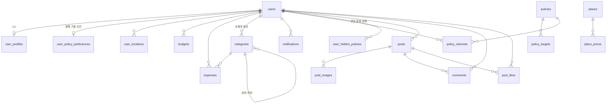

# 생존일기 DB 스키마 명세서

| 항목 | 내용 |
|---|---|
| DBMS | MySQL 8.x |
| 문자셋 | `utf8mb4` / `utf8mb4_unicode_ci` |
| 스키마 정본 | `src/main/resources/db/migration/` 전체 (Flyway) |
| 기준 버전 | V8 (2026-08-03) |
| 테이블 수 | 17 |

> 스키마 변경은 이 문서 수정이 아니라 **새 Flyway 마이그레이션(V2, V3…) 추가**로 한다.
> 적용된 마이그레이션 파일은 수정 금지. 변경 후 이 문서를 함께 갱신한다.

---

## 공통 규칙

- 테이블명: 복수형 snake_case (`users`, `post_images`)
- PK: `BIGINT UNSIGNED AUTO_INCREMENT`, `{단수명}_id`
- 날짜 컬럼: `_date`(DATE) / `_at`(DATETIME) 접미사. 생성 시각은 `created_at DEFAULT CURRENT_TIMESTAMP`
- 금액: 원 단위 `INT UNSIGNED` / 좌표: `DECIMAL(10,7)` / 불리언: `TINYINT(1)`
- enum성 값: `VARCHAR` + 대문자 코드 (JPA `@Enumerated(EnumType.STRING)` 대응)
- 사용자 소유 데이터의 FK는 `ON DELETE CASCADE` (회원 탈퇴 시 연쇄 삭제)

## 관계도

---

## 1. 사용자 / 계정

### users — 사용자

| 컬럼 | 타입 | Null | 키/제약 | 기본값 | 설명 |
|---|---|---|---|---|---|
| user_id | BIGINT UNSIGNED | N | PK, AI | | |
| email | VARCHAR(255) | N | UNIQUE | | 로그인 이메일 |
| password | VARCHAR(255) | N | | | BCrypt 해시 (평문 금지) |
| name | VARCHAR(50) | N | | | 이름 |
| birth_date | DATE | Y | | | 생년월일 — 나이는 저장하지 않고 여기서 계산 |
| gender | VARCHAR(10) | Y | | | `MALE` / `FEMALE` / `OTHER` |
| region | VARCHAR(50) | Y | | | 지역 |
| role | VARCHAR(20) | N | | `USER` | `USER` / `ADMIN` |
| created_at | DATETIME | N | | NOW | 가입일 |

### user_profiles — 사용자 프로필 (users 1:1)

| 컬럼 | 타입 | Null | 키/제약 | 기본값 | 설명 |
|---|---|---|---|---|---|
| profile_id | BIGINT UNSIGNED | N | PK, AI | | |
| user_id | BIGINT UNSIGNED | N | FK(users), UNIQUE, CASCADE | | |
| employment_status | VARCHAR(30) | Y | | | `EMPLOYED` / `JOB_SEEKING` / `STUDENT` 등 |
| job | VARCHAR(50) | Y | | | 직업 |
| bio | VARCHAR(500) | Y | | | 소개 |
| profile_image_url | VARCHAR(500) | Y | | | 프로필 이미지 URL |

### user_policy_preferences — 맞춤 정책 기본 조건 (users 1:1)

| 컬럼 | 타입 | Null | 키/제약 | 기본값 | 설명 |
|---|---|---|---|---|---|
| user_id | BIGINT UNSIGNED | N | PK, FK(users), CASCADE | | 로그인 사용자 ID |
| age | INT | Y | | | 생년월일이 없는 사용자가 입력한 현재 만 나이 |
| region_code | CHAR(2) | N | | | 법정동 시도 코드 앞 2자리 |
| district_code | CHAR(5) | Y | | | 법정동 시군구 코드 앞 5자리, 시도 전체면 NULL |
| employment_status | VARCHAR(30) | N | | | 취업 상태 코드 |
| income_range | VARCHAR(30) | Y | | | 소득 구간, 무관이면 NULL |
| category | VARCHAR(30) | Y | | | 정책 분야, 전체면 NULL |
| created_at | DATETIME | N | | NOW | 최초 저장 시각 |
| updated_at | DATETIME | N | | NOW | 마지막 변경 시각 |

`users.birth_date`가 있으면 계산한 만 나이를 우선 사용한다. 소셜 제공처가 생년월일을 제공하지
않은 경우에만 이 테이블의 `age`를 대체값으로 사용하고, 조건 수정 시 최신 입력값으로 갱신한다.

### user_locations — 사용자 위치 설정

| 컬럼 | 타입 | Null | 키/제약 | 기본값 | 설명 |
|---|---|---|---|---|---|
| location_id | BIGINT UNSIGNED | N | PK, AI | | |
| user_id | BIGINT UNSIGNED | N | FK(users), IDX, CASCADE | | |
| address | VARCHAR(255) | N | | | 주소 |
| latitude | DECIMAL(10,7) | N | | | 위도 |
| longitude | DECIMAL(10,7) | N | | | 경도 |
| created_at | DATETIME | N | | NOW | 등록일 |

---

## 2. 절약 일기 (예산 / 지출 / 카테고리)

### categories — 지출 카테고리

| 컬럼 | 타입 | Null | 키/제약 | 기본값 | 설명 |
|---|---|---|---|---|---|
| category_id | BIGINT UNSIGNED | N | PK, AI | | |
| user_id | BIGINT UNSIGNED | Y | FK(users), IDX, CASCADE | | **NULL = 시스템 기본 카테고리**, 값 있으면 사용자 정의 |
| parent_category_id | BIGINT UNSIGNED | Y | FK(categories), SET NULL | | 상위 카테고리 (선택) |
| name | VARCHAR(50) | N | | | 카테고리명 |
| icon | VARCHAR(50) | Y | | | 아이콘 식별자 |
| color | VARCHAR(9) | Y | | | HEX (`#RRGGBB`) |

기본 시드 5건: 식비 / 카페 / 교통 / 쇼핑 / 기타 (앱 `ExpenseCategory` enum과 동일)

### budgets — 예산

| 컬럼 | 타입 | Null | 키/제약 | 기본값 | 설명 |
|---|---|---|---|---|---|
| budget_id | BIGINT UNSIGNED | N | PK, AI | | |
| user_id | BIGINT UNSIGNED | N | FK(users), CASCADE | | |
| budget_date | DATE | N | UNIQUE(user_id, budget_date) | | 날짜 (일 단위 예산) |
| amount | INT UNSIGNED | N | | | 사용 가능 금액 (원) |
| alert_ratio | TINYINT UNSIGNED | N | | 80 | 알림 기준 비율 (%) |
| created_at | DATETIME | N | | NOW | 생성일 |

### expenses — 지출 내역

| 컬럼 | 타입 | Null | 키/제약 | 기본값 | 설명 |
|---|---|---|---|---|---|
| expense_id | BIGINT UNSIGNED | N | PK, AI | | |
| user_id | BIGINT UNSIGNED | N | FK(users), CASCADE | | |
| category_id | BIGINT UNSIGNED | N | FK(categories), IDX | | |
| title | VARCHAR(100) | N | | | 지출 내용 또는 감지된 가맹점명 |
| amount | INT UNSIGNED | N | | | 금액 (원) |
| spent_at | DATETIME | N | IDX(user_id, spent_at) | | 지출일시 |
| memo | VARCHAR(200) | Y | | | 내용 (메모) |
| payment_method | VARCHAR(30) | Y | | | `CARD` / `CASH` / `TRANSFER` 등 |
| entry_type | VARCHAR(10) | N | | `MANUAL` | `AUTO`(알림 감지) / `MANUAL`(직접 등록) |
| notification_source | VARCHAR(100) | Y | | | 자동 감지 결제 알림 출처 |
| detection_key | VARCHAR(64) | Y | UK(user_id, detection_key) | | 사용자별 알림 중복 방지 키 |
| receipt_image_url | VARCHAR(500) | Y | | | 영수증 이미지 URL (선택) |
| created_at | DATETIME | N | | NOW | 등록일 |

### notifications — 알림

| 컬럼 | 타입 | Null | 키/제약 | 기본값 | 설명 |
|---|---|---|---|---|---|
| notification_id | BIGINT UNSIGNED | N | PK, AI | | |
| user_id | BIGINT UNSIGNED | N | FK(users), IDX(user_id, is_read), CASCADE | | |
| type | VARCHAR(20) | N | | | `BUDGET` / `POLICY` / `COMMUNITY` 등 |
| title | VARCHAR(100) | N | | | 제목 |
| content | VARCHAR(500) | Y | | | 내용 |
| is_read | TINYINT(1) | N | | 0 | 읽음 여부 |
| created_at | DATETIME | N | | NOW | 생성일 |

---

## 3. 청년 정책

### policies — 청년정책

| 컬럼 | 타입 | Null | 키/제약 | 기본값 | 설명 |
|---|---|---|---|---|---|
| policy_id | BIGINT UNSIGNED | N | PK, AI | | |
| title | VARCHAR(200) | N | | | 제목 |
| description | TEXT | Y | | | 설명 |
| support_target | VARCHAR(500) | Y | | | 지원대상 |
| support_content | TEXT | Y | | | 지원내용 |
| support_amount | INT UNSIGNED | Y | | | 지원금 (원, 예상) |
| apply_start_date | DATE | Y | | | 신청기간 시작 |
| apply_end_date | DATE | Y | IDX | | 신청기간 종료 |
| agency | VARCHAR(100) | Y | | | 주관기관 |
| detail_url | VARCHAR(500) | Y | | | 상세 링크 |
| created_at | DATETIME | N | | NOW | 등록일 |

### policy_targets — 정책 대상 조건

| 컬럼 | 타입 | Null | 키/제약 | 기본값 | 설명 |
|---|---|---|---|---|---|
| target_id | BIGINT UNSIGNED | N | PK, AI | | |
| policy_id | BIGINT UNSIGNED | N | FK(policies), IDX, CASCADE | | |
| min_age | TINYINT UNSIGNED | Y | | | 나이 조건 (최소) |
| max_age | TINYINT UNSIGNED | Y | | | 나이 조건 (최대) |
| region | VARCHAR(50) | Y | | | 지역 |
| employment_status | VARCHAR(30) | Y | | | 취업 상태 |
| other_conditions | VARCHAR(500) | Y | | | 기타 조건 |

### policy_interests — 정책 관심

| 컬럼 | 타입 | Null | 키/제약 | 기본값 | 설명 |
|---|---|---|---|---|---|
| interest_id | BIGINT UNSIGNED | N | PK, AI | | |
| user_id | BIGINT UNSIGNED | N | FK(users), UNIQUE(user_id, policy_id), CASCADE | | |
| policy_id | BIGINT UNSIGNED | N | FK(policies), CASCADE | | |
| status | VARCHAR(20) | N | | `INTERESTED` | `INTERESTED`(관심) / `PLANNED`(신청예정) / `APPLIED`(신청완료) |
| created_at | DATETIME | N | | NOW | 저장일 |

### user_hidden_policies — 사용자별 관심 없음 정책

온통청년의 문자열 정책 번호와 목록 표시용 스냅샷을 저장한다. 내부 `policies` 테이블의 숫자 PK를
사용하는 `policy_interests`와 목적과 식별자 형식이 다르므로 별도 테이블로 관리한다.

| 컬럼 | 타입 | Null | 키/제약 | 기본값 | 설명 |
|---|---|---|---|---|---|
| hidden_policy_id | BIGINT UNSIGNED | N | PK, AI | | |
| user_id | BIGINT UNSIGNED | N | FK(users), UNIQUE(user_id, policy_id), CASCADE | | 로그인 사용자 |
| policy_id | VARCHAR(100) | N | UNIQUE(user_id, policy_id) | | 온통청년 정책 번호 |
| title | VARCHAR(200) | N | | | 숨길 당시 정책명 |
| category | VARCHAR(100) | Y | | | 숨길 당시 정책 분야 |
| short_summary | VARCHAR(500) | Y | | | 숨길 당시 목록 요약 |
| hidden_at | DATETIME | N | IDX(user_id, hidden_at) | NOW | 관심 없음 설정 시각 |

---

## 4. 절약 지도 (장소)

### places — 장소

| 컬럼 | 타입 | Null | 키/제약 | 기본값 | 설명 |
|---|---|---|---|---|---|
| place_id | BIGINT UNSIGNED | N | PK, AI | | |
| name | VARCHAR(100) | N | | | 장소명 |
| place_type | VARCHAR(20) | N | IDX | | `GOOD_PRICE`(착한가격업소) / `PUBLIC_FACILITY`(공공시설) / `PUBLIC_PARKING`(공영주차장) |
| latitude | DECIMAL(10,7) | N | IDX(latitude, longitude) | | 위도 |
| longitude | DECIMAL(10,7) | N | | | 경도 |
| address | VARCHAR(255) | N | | | 주소 |
| phone | VARCHAR(20) | Y | | | 전화번호 |

### place_prices — 장소 가격 정보

| 컬럼 | 타입 | Null | 키/제약 | 기본값 | 설명 |
|---|---|---|---|---|---|
| price_id | BIGINT UNSIGNED | N | PK, AI | | |
| place_id | BIGINT UNSIGNED | N | FK(places), IDX, CASCADE | | |
| price | INT UNSIGNED | N | | | 가격 (원) |
| base_date | DATE | N | | | 기준일 |

---

## 5. 커뮤니티

### posts — 게시글

| 컬럼 | 타입 | Null | 키/제약 | 기본값 | 설명 |
|---|---|---|---|---|---|
| post_id | BIGINT UNSIGNED | N | PK, AI | | |
| user_id | BIGINT UNSIGNED | N | FK(users), IDX, CASCADE | | 작성자 |
| category | VARCHAR(30) | N | IDX(category, created_at) | | 게시글 카테고리 |
| title | VARCHAR(200) | N | | | 제목 |
| content | MEDIUMTEXT | N | | | 에디터 HTML (최대 16MB). **base64 이미지 삽입 금지** — 이미지는 URL만 |
| view_count | INT UNSIGNED | N | | 0 | 조회수 |
| created_at | DATETIME | N | | NOW | 작성일 |
| updated_at | DATETIME | Y | | ON UPDATE NOW | 수정일 |

### post_images — 게시글 이미지 (1:N)

| 컬럼 | 타입 | Null | 키/제약 | 기본값 | 설명 |
|---|---|---|---|---|---|
| image_id | BIGINT UNSIGNED | N | PK, AI | | |
| post_id | BIGINT UNSIGNED | N | FK(posts), IDX, CASCADE | | 글 삭제 시 함께 삭제 |
| image_url | VARCHAR(500) | N | | | 이미지 URL / 스토리지 경로 |
| sort_order | INT UNSIGNED | N | | 0 | 표시 순서. **0 = 대표(썸네일)** |
| created_at | DATETIME | N | | NOW | 업로드일 |

에디터로 업로드한 이미지 URL을 행 단위로 기록 — 장수 제한 없음.
용도: 목록 썸네일 조회 / 고아 이미지 배치 정리 / 스토리지 이전 / 글 삭제 시 파일 삭제 연동.

### comments — 댓글

| 컬럼 | 타입 | Null | 키/제약 | 기본값 | 설명 |
|---|---|---|---|---|---|
| comment_id | BIGINT UNSIGNED | N | PK, AI | | |
| post_id | BIGINT UNSIGNED | N | FK(posts), IDX, CASCADE | | |
| user_id | BIGINT UNSIGNED | N | FK(users), IDX, CASCADE | | 작성자 |
| content | VARCHAR(1000) | N | | | 내용 |
| created_at | DATETIME | N | | NOW | 작성일 |

### post_likes — 게시글 좋아요

| 컬럼 | 타입 | Null | 키/제약 | 기본값 | 설명 |
|---|---|---|---|---|---|
| like_id | BIGINT UNSIGNED | N | PK, AI | | |
| post_id | BIGINT UNSIGNED | N | FK(posts), UNIQUE(post_id, user_id), CASCADE | | 중복 좋아요 방지 |
| user_id | BIGINT UNSIGNED | N | FK(users), CASCADE | | |
| created_at | DATETIME | N | | NOW | 등록일 |

---

## 부록: ERD(한글) → 컬럼 변환 대조표

원본 ERD의 한글 항목과 영어 컬럼 대응은 [README.md 2절](README.md#2-erd--영어-컬럼-변환-규칙) 참조.
ERD 대비 변경점:

| 변경 | 이유 |
|---|---|
| `user_profiles.나이` 제거 | 나이는 매년 변하므로 저장하지 않고 `users.birth_date`에서 계산 |
| `post_images` 테이블 신설 | 에디터 다중 이미지 첨부 지원 (게시글 1:N) |
| 좋아요/관심/예산에 UNIQUE 제약 추가 | 중복 데이터 방지를 DB 수준에서 보장 |
